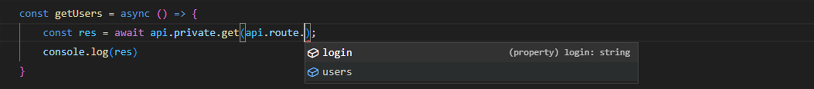

# Axios Config Helper
<a href="#details">
&nbsp;&nbsp;</a>


A helper for configuring the client API service using [axios](https://axios-http.com/)

## Table of contents

- [Install](#install)
- [Quick start](#quick-start)
- [API](#api-public)
- - [public](#api-public)
- - [private](#api-private)
- - [cookie](#api-cookie)
- [Create Axios Api](#create-axios-api)
- - [Configurations](#configurations)
- [Route](#route)
- [Typescript](#typescript)


## Install
```bash
pnpm i @andremalveira/axios
```


## Quick start

```ts
// Login example

import api from '@andremalveira/axios';

const res = await api.public.post('{baseUrl}/login', { username, password });
const token = res.data.token;

api.cookie.set(token)
```

```ts
// Api route private

import api from '@andremalveira/axios';

const res = await api.private.post('{baseUrl}/user');
const data = res.data;
```
### API Public
 > For requests that don't need authentication. The `public` method is `axios default mode`, no token checking is done.

### API Private
 > For requests that need to send authentication token. The `private` method, by default, has interceptors configured to check if there is a token in the cookie and passes this token in the authorization header, if it does not exist, an `Unauthorized` error is returned.

### API Cookie
 > Used to treat the token in the cookie, it has the `set`, `get` and `remove` methods. 

### API Route
 > A helper for configuring the api's use of routes, see how to use [api route](#route).


## Create Axios Api

```ts
// services/api.ts

import { createAxiosApi } from '@andremalveira/axios';

const api = createAxiosApi(); // createAxiosApi(config)
```

### Configurations
> Config extends default axios configuration [`CreateAxiosDefaults`](https://github.com/axios/axios/blob/649d739288c8e2c55829ac60e2345a0f3439c730/index.d.ts#L263). <br/><br/>
[baseURL](#baseurl) <br/>
[tokenAccessType](#tokenaccesstype) <br/>
[cookie](#cookie) <br/>
[refreshToken](#refreshtoken) <br/>
[route](#route) or [endpoint](#route) <br/>

### baseUrl
> Api base url

### tokenAccessType
> Authorization header access type <br/>
> _default_: _`Bearer`_

### cookie
> Cookie settings <br/>
> _properties_:
> - `name`: _default_: _`_token`_
> - `options`: extends from [`CookieAttributes `](https://github.com/DefinitelyTyped/DefinitelyTyped/blob/master/types/js-cookie/index.d.ts#L12)

### refreshToken
> Receives a promise function that returns the updated `token`. <br/>
>  - param: `token`
>  - return: `token` - required
> ```ts
> // services/api.ts
>
>import { createAxiosApi } from '@andremalveira/axios';
>
> const api = createAxiosApi({
>⠀⠀⠀baseURL: 'https://api',    
>⠀⠀⠀refreshToken: async (token) => {
>⠀⠀⠀⠀⠀const res = await api.public.post('/refreshtoken', { token });
>⠀⠀⠀⠀⠀const newToken = res.data.token as string
>⠀⠀⠀⠀⠀return newToken
>⠀⠀⠀}
> })
> ```


## Route
A helper for configuring the api's use of routes
> ⭐ See about [`Helpers for creating API route paths to the client.`](https://github.com/andremalveira/route#route)

```ts
// routes/api.routes.ts

const routes = {
    login: '/auth/login',
    users: '/users'
}
export default routes
```

```ts
// services/api.ts

import { createAxiosApi } from '@andremalveira/axios';
import routes from 'routes/api.routes';

const api = createAxiosApi({
⠀⠀⠀baseURL: 'https://api',
⠀⠀⠀route: routes, // or endpoint: routes
})
```

```ts
// Example of use

const res = await api.public.post(api.route.login)
```

### Using typescript for `route type`

```ts
// services/api.ts

import routes from 'routes/api.routes';

const api = createAxiosApi<{ route: typeof routes }>({
⠀⠀⠀baseURL: 'https://api',
⠀⠀⠀route: routes,
})
```



## Related / Dependencies
[axios](https://github.com/axios/axios) <br/>
[js-cookie](https://github.com/js-cookie/js-cookie)


## Licence 
[MIT](LICENSE)
